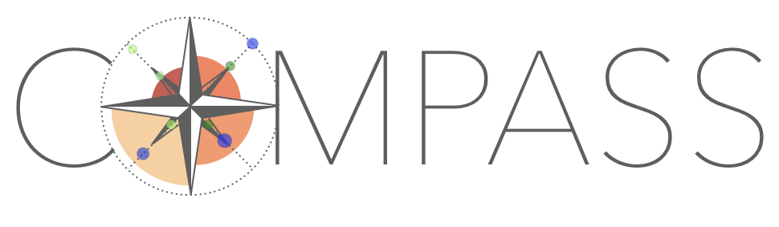

COMPASS
-------
Welcome! The COMPASS (Compositions of Mini-Planets for Atmospheric Statistical Study) Program is a JWST exoplanet atmospheres survey designed to build a critical link between atmospheric characterization and planetary demographics.

Our GitHub will be populated with scripts to reproduce all data analyses published as part of this program. 

Resources 
---------

- Planets in our sample: compass-jwst.github.io/planets.html
- Timeline for data arrival: compass-jwst.github.io/timeline.html
- Our Team: compass-jwst.github.io/team.html
- Collaboration Guidelines: compass-jwst.github.io/collab.html
